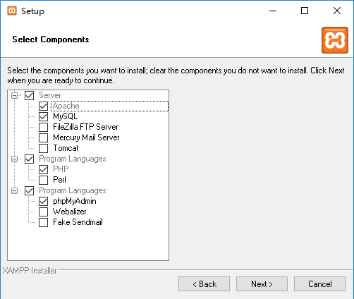
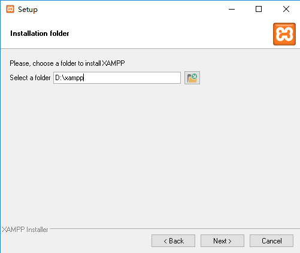
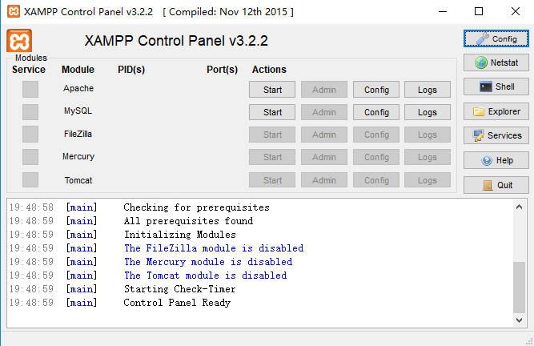
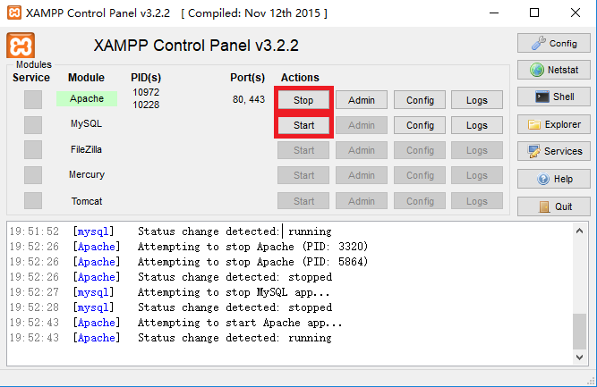
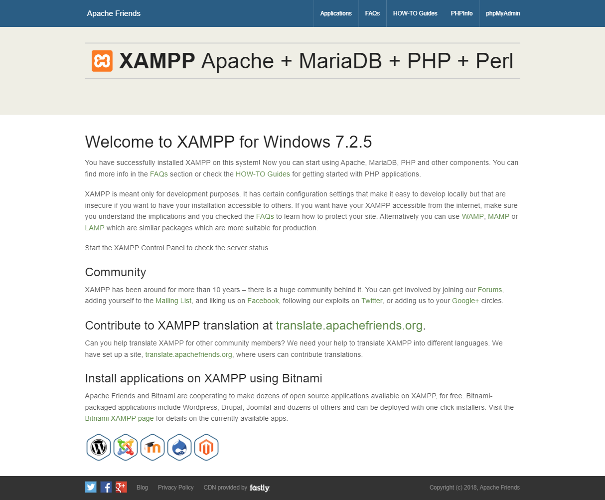
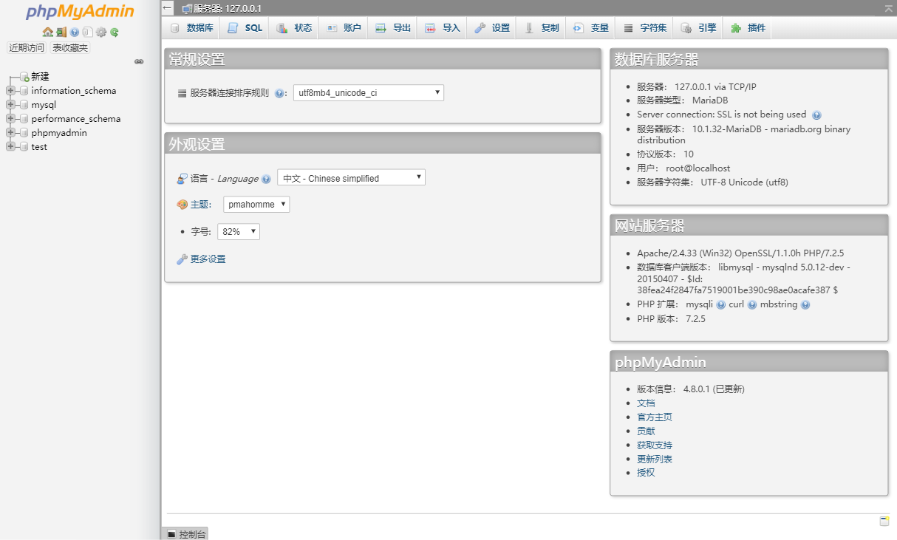

# PHP Apache MySQL 环境搭建指南

## Windows

### 下载 XAMPP

访问 [XAMPP 官方网站](https://www.apachefriends.org/zh_cn/index.html)

选择下载 [XAMPP for Windows](https://downloadsapachefriends.global.ssl.fastly.net/xampp-files/7.2.5/xampp-win32-7.2.5-0-VC15-installer.exe?from_af=true)

如果下载速度太慢，你也可以选择下载 TA 放在百度云上的安装程序：

链接：[https://pan.baidu.com/s/1x-tNvd48U8ifZtxjuEuTpg](https://pan.baidu.com/s/1x-tNvd48U8ifZtxjuEuTpg) 密码：6fto

### 安装 XAMPP

双击安装程序 **xampp-win32-7.2.5-0-VC15-installer.exe**

一路确定后来到 **Select Components** 界面，选择如下必需的组件即可：

接下来选择安装路径，这里我选择将 XAMPP 安装在 `D:\xampp`：

然后执行安装程序，等到完成后选择英文界面，我们可以看到如下的控制界面：

### 使用 XAMPP

选择控制界面上的两个 **Start** 按钮，开启 `Apache` 和 `MySQL` 服务

打开浏览器，在地址栏输入 `localhost` 或 `127.0.0.1`，即可看到如下界面：

点击右上角的 `phpMyAdmin`，即可进入 `MySQL` 管理界面：

### 可能遇到的问题

如果你完成以上步骤但却并没有成功启动相应环境，极有可能是端口占用问题

具体原因请参考控制台输出的报错信息，解决方案请参考网上教程，这里不一一缀叙~~ 如果无法解决，可以询问 TA 或在课程群中讨论

## macOS

## Linux

既然是选择使用 Linux 的大佬，请自行 `百度` / `Google` 解决相应方案

有问题为什么不先问问神奇海螺呢（逃