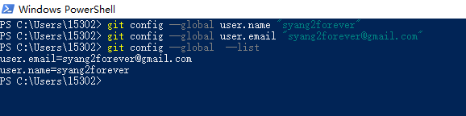
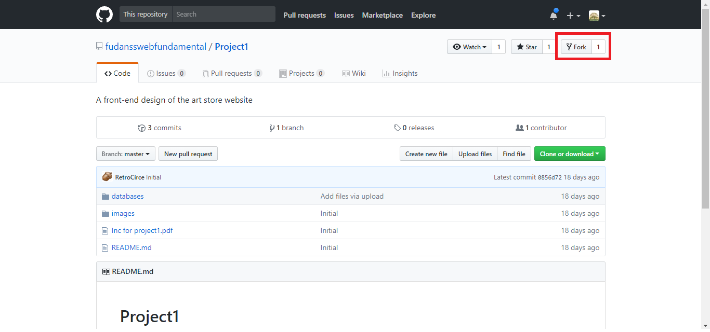
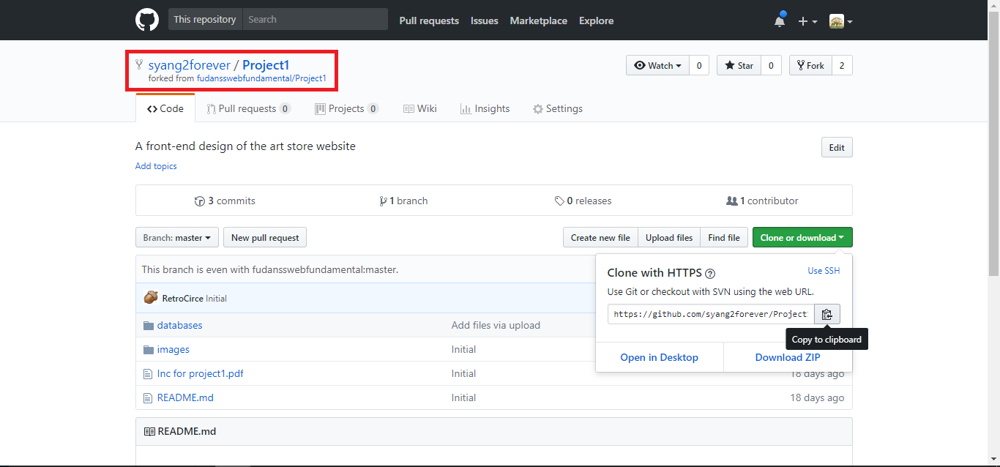
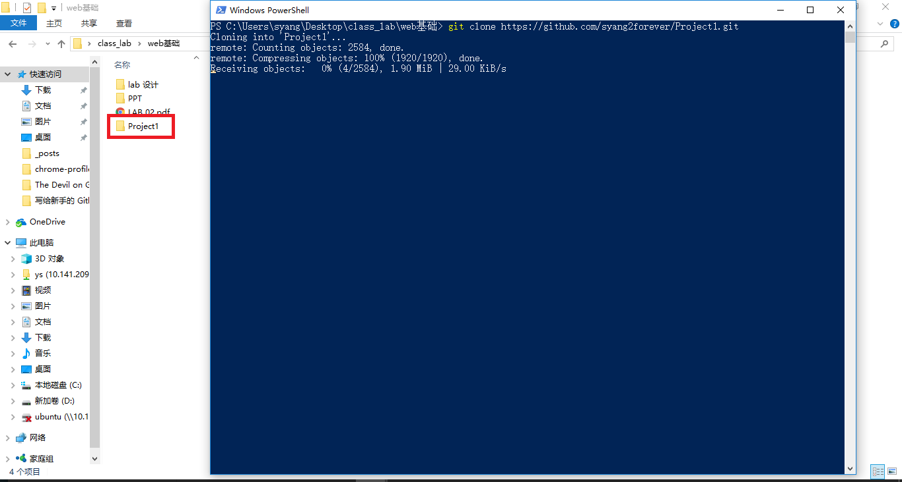
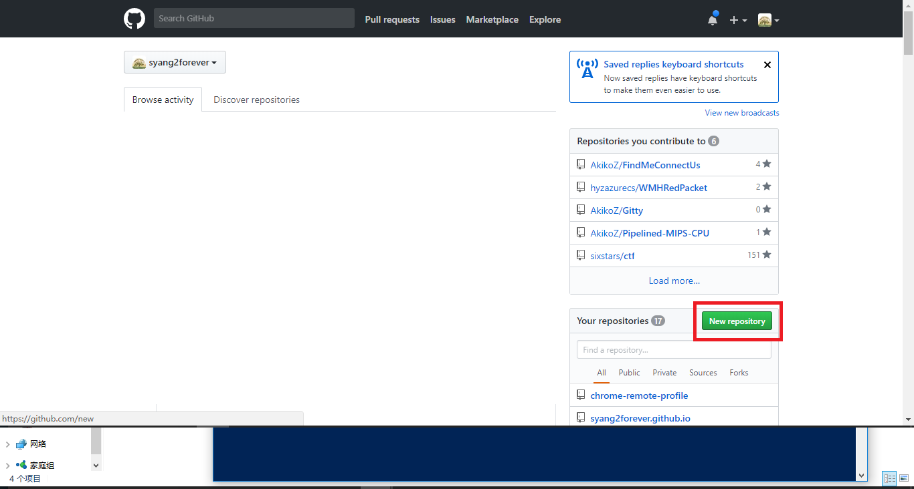
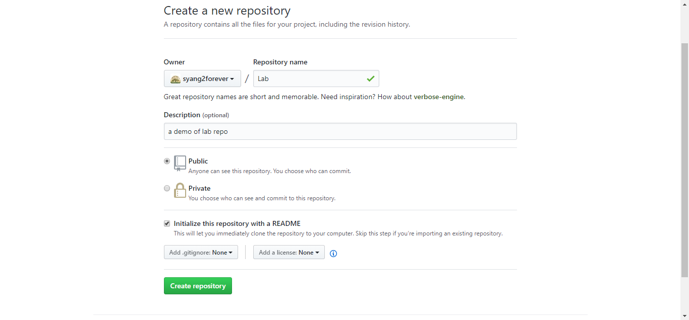
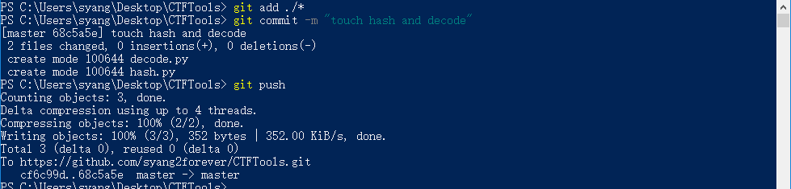

# 写给新手的 Github 指南

## Git

### 关于 Git

Git是什么？

Git是目前世界上最先进的分布式版本控制系统（没有之一）。

Git有什么特点？简单来说就是：高端大气上档次！

那什么是版本控制系统？

如果你在写 Lab 过程中想要修改一个函数，但害怕修改完成之后出现了 Bug，所以不舍得删除之前的代码，那么你会怎么办？之前我们通常的做法是，将这个文件重新复制一份，然后在新文件的基础上修改...那么一段时间之后你的 Lab 文件夹就可能变成了这样：


然后你发现果然写 Bug 了，但这时候已经不知道哪个文件是正确的代码了，只好一个个来找，相当麻烦。而且更可怕的是，看着这些乱七八糟的文件，看着很碍眼，想删除又不敢删除，深怕哪天又要重新用上，可以说是非常令人苦恼了😰

还有一个问题就是，如果你需要和你的同学组队完成一个项目（当然本门课暂时不存在这种情况），那么你们之间该怎么同步自己写的代码？使用 U 盘进行拷贝，然后手动合并两个人的修改？是不是相当繁琐复杂？

然后你是不是期待有这样一款软件，不但能自动记录每次文件的改动，还可以让同学协作编辑，不用自己手动进行管理，也不需要把文件传来传去。如果想查看某次改动，只需要在软件里瞄一眼就可以，岂不是很方便？Git 就是这样一款软件：

```cmd
PS C:\...\> git log
commit cb85c058a0dee832876bab3fe60cea23ffd4488b (HEAD -> master, origin/master, origin/HEAD)
Author: syang2forever <syang2forever@gmail.com>
Date:   Wed Mar 14 16:05:20 2018 +0800

    add try catch to app.js

commit 432f8b4f6613ba68ea3ceced23c7c390188a34f1
Author: syang2forever <syang2forever@gmail.com>
Date:   Mon Mar 12 10:23:23 2018 +0800

    #fix db error caused by not disconnecting
```

### 下载 Git

- [Windows 下载链接](https://gitforwindows.org/)
- macOS 自带 git，请在 `Terminal` 里尝试运行 `git` 命令
- Linux(CentOS) `sudo yum install git-core`
- Linux(Ubuntu) `sudo apt-get install git`

### Git 初始化

在第一次使用 git 的时候，需要配置个人信息，具体配置方式如下，打开命令行界面：

```shell
# 设置用户名字
git config --global user.name "web"
# 设置用户邮箱
git config --global user.email web@example.com

# 显示配置信息
git config --global --list
# 如果命令行上显示如下输入，即表示配置成功
# user.email=web@example.com
# user.name=web
```

TA 的示范操作如下：



## GitHub

### Github 是什么

当我们在编写程序的时候，往往需要和他人协作共同完成一个软件的开发。对于大型软件来说，团队中成员之间的协作以及代码的版本管理变得尤为重要。

GitHub 就是这样一个提供了版本控制的代码。也就是说，你可以将一个项目的代码存储在 GitHub 的一个仓库，并允许别人与你共同开发这个项目。除此之外，它也提供了一些方便社会化软件开发的功能，包括运行用户追踪其他用户、组织、软件库的动态，对软件代码的改动和 bug 提出评论等。GitHub 同时也提供了图表，用于显示开发者们怎样在代码库上工作以及软件的开发活跃程度。

以上说明来自某优秀的开源作者，FDU 13SS 学长，下面是不正经的说明：
全球最大的同行交友平台 GitHub-[https://github.com/](https://github.com/) 上线啦！！！优秀作者，开源代码，给您不一样的编程体验！

### 我们使用 GitHub 做什么

在之后的 Lab 中，我们或许会尝试使用 GitHub 来发布我们的 Lab，而你们也需要通过 GitHub 来提交你们完成的 Lab，大致流程如下：
1. TA 在 GitHub 上发布了本次作业的说明文档和项目文件
2. 你通过 `Fork` 的方式将 TA 发布的 Lab 拷贝到自己的仓库中
3. 你通过 `git clone` 的方式将位于 GitHub 仓库上的代码下载到本地仓库
4. 在完成 Lab 之后，你需要将本地仓库上的数据同步到 GitHub 上

或者你也可以选择：
1. 自己建立相应的 GitHub 仓库
2. 通过 `git clone` 的方式将位于 GitHub 上的仓库同步到本地
3. 在完成 Lab 之后，你需要将本地仓库上的数据同步到 GitHub 上

具体的流程可以参考之后 TA 给出的说明

### 如何使用 GitHub

1. 注册 GitHub 账号，请选择喜欢的用户名、邮箱以及密码，点击 `Sign up for GitHub` 进行注册。

[GitHub 首页](./pictures/github.png)

2. 访问课程项目仓库 [https://github.com/fudansswebfundamental](https://github.com/fudansswebfundamental)

3. 选择右上角的 `Fork` 复制该仓库



4. 可以看到我们已经复制了该仓库，那么我们可以通过右上角的 `Clone or download` 复制该页面的链接



5. 然后我们选择将通过在命令行/终端中运行如下命令：

```shell
git clone https://github.com/syang2forever/Project1.git
```

可以看见我们已经将 GitHub 上的仓库同步到本地了：



6. 或者我们可以直接通过创建仓库的方式建立自己的作业仓库：





7. 然后我们可以通过类似的步骤将仓库同步到本地

### 提交你的修改

如果你完成了本地的修改，希望将本地的 Lab 同步到 GitHub 上的话，可以运行如下指令：

```shell
git add ./*
git commit -m "infomation"
git push
```

其中，`git add ./*` 表示提交所有文件到缓冲区，当然你也可以只提交部分文件：`git add xxx.xxx`。

然后 `commit` 表示一次提交，`-m "xxxxx"` 表示这次提交的注释，是必不可少的。

最后的 `git push` 表示将代码同步到远程仓库。



当然，上面的三步操作是为了简化操作，想要了解操作的具体含义需要你们自己查阅相应文档，如有需要，可以参考 [常用 Git 命令清单](http://www.ruanyifeng.com/blog/2015/12/git-cheat-sheet.html)

### 同步每次的 lab 作业文件

为了方便获取每次的 lab 更新，可以运行如下命令：

```shell
# add remote 
git remote add release https://github.com/fudansswebfundamental/fdu-18ss-web-lab.git
# show remote
git remote -v
```


在这之后，如果每次有新的作业布置时，你可以通过运行如下命令方便地获取到更新的 lab 文件：

```shell
git pull release master
```

操作示范如下：


## 结语

如果你对编程有着强烈兴趣的话，那么 GitHub 绝对是个 veryoc 的网站，just enjoy it!!!

虽然 git 的起步可能有一定的难度，但这种难度时可以通过上网查阅文档、请教 TA 等方式克服的！请务必再努力一下！


## 参考链接

- [Git 简介](https://www.liaoxuefeng.com/wiki/0013739516305929606dd18361248578c67b8067c8c017b000/001373962845513aefd77a99f4145f0a2c7a7ca057e7570000)
