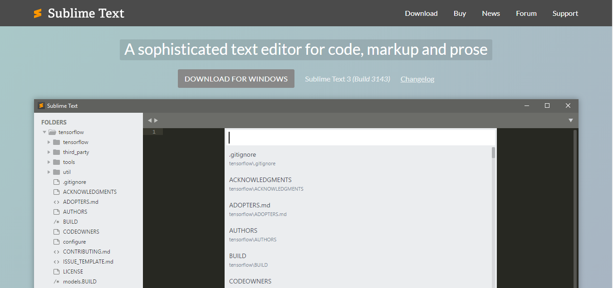
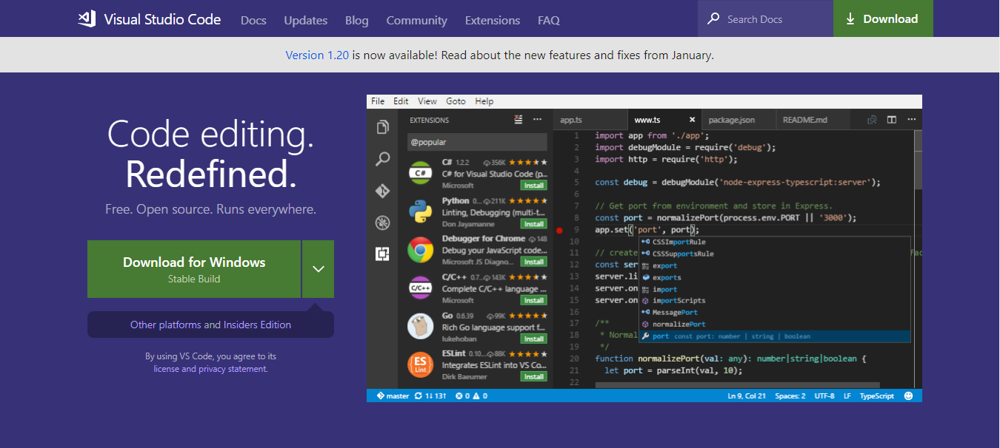
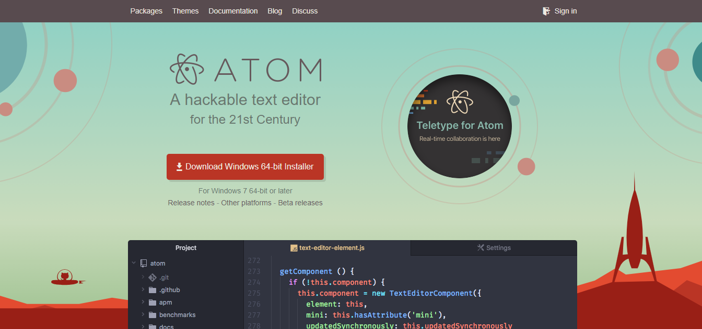
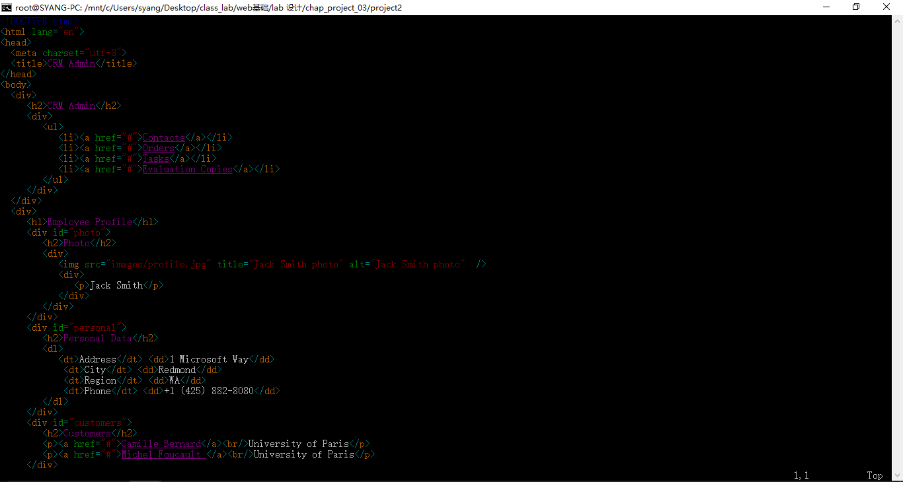
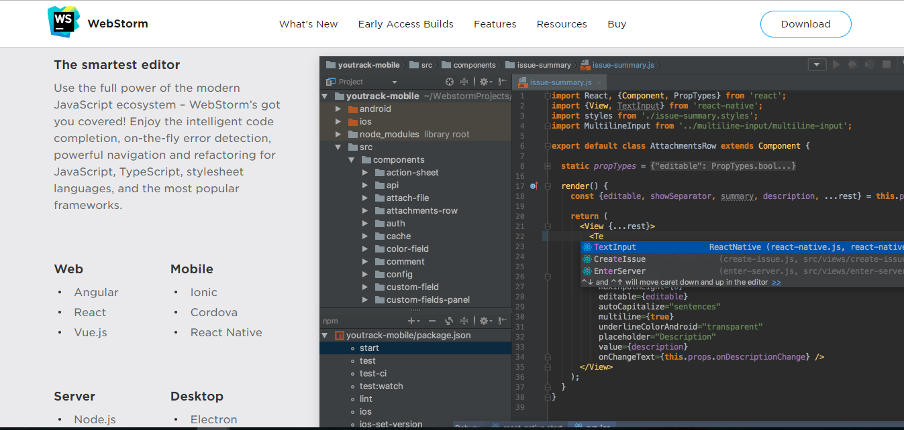
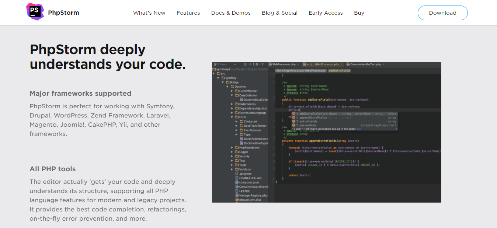

# 开发工具介绍

## 概述

一个优秀的开发工具能极大地提升代码编写的效率，一般而言我们会使用 `文本编辑器` 或者 `IDE` 进行代码开发

一般被称为文本编辑器的软件，较为轻量级，启动速度较快，相应功能上弱于 IDE

而集成开发环境（Integrated Development Environment，简称 IDE）功能相对强大，但相应更为重量级，启动速度较慢

推荐使用文本编辑器完成 Lab，使用 IDE 完成 Project，但根据个人喜好全部用文本编辑器开发或全部使用 IDE 开发均可

## 文本编辑器

PS：**Sublime Text**、**Visual Studio Code**、**Atom** 这三者都有着丰富的插件可供使用，选择合适的插件可以提高编辑器的可用性，相应编辑器插件请自己去挖掘（可以通过 google 搜索推荐插件等）

### Sublime Text

Sublime Text 是一套跨平台的文本编辑器，支持基于 Python 的插件

[下载地址](https://www.sublimetext.com/)

### Visual Studio Code

Visual Studio Code（VS Code）是一个由微软开发的，同时支持 Windows、Linux 和 macOS 操作系统的开源文本编辑器。

[下载地址](https://code.visualstudio.com/)

### Atom

Atom 是由 GitHub 开发的开源的文字与代码编辑器，支持 OS X、Windows 和 Linux 操作系统，支持 Node.js 所写的插件，并内置由 Github 提供的 Git 版本控制系统

[下载地址](https://atom.io/)

### Vim 或 Emacs

既然你选了用 Vim 或 Emacs 进行开发，那么务必熟悉命令行操作和提高自己代码编写速度

一般而言不建议使用 Vim/Emacs 完成本学期课程相应的 Lab/Project，除非有迫不得已的理由（如装x等

### 记事本

不建议，理由你懂的

## IDE

### WebStorm

Jetbrains 公司旗下一款 Web 开发工具，支持 Javascript、TypeScript 等开发

[下载地址](https://www.jetbrains.com/webstorm/download/)

### PhpStorm

Jetbrains 公司旗下一款开发工具，支持 PHP 和 Web 开发

[下载地址](https://www.jetbrains.com/phpstorm/download/)

考虑到二者功能上的相似性以及本学期后期对 `PHP` 开发的需求，同学们可以直接安装 PhpStorm
