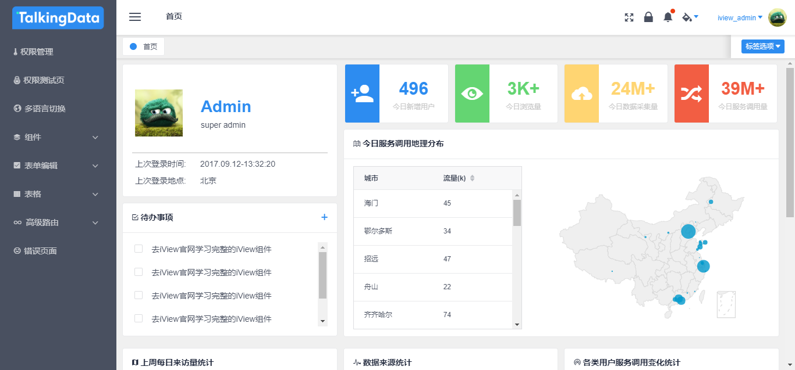

# 自由而没用的 nodejs 起步指南

## 关于 nodejs

Node.js 是一个基于 Chrome V8 引擎的 JavaScript 运行环境。 
Node.js 使用了一个事件驱动、非阻塞式 I/O 的模型，使其轻量又高效。 
Node.js 的包管理器 npm，是全球最大的开源库生态系统

你还可以通过使用 Node.js 的方式快速成为全栈工程师（误

关于 Node.js 的优缺点请自行 百度 / Google

## 安装

### Windows

1. 访问 [官方下载地址](https://nodejs.org/en/download/current/)
2. 根据你电脑的系统 32-bit/64-bit，选择下载相应的 msi 安装包: [32-bit](https://nodejs.org/dist/v10.0.0/node-v10.0.0-x86.msi)/[64-bit](https://nodejs.org/dist/v10.0.0/node-v10.0.0-x64.msi)
3. 下载完成后双击安装即可

### macOS

1. 访问 [官方下载地址](https://nodejs.org/en/download/current/)
2. 下载相应的 [macOS Installer (.pkg)](https://nodejs.org/dist/v10.0.0/node-v10.0.0.pkg)
3. 下载完成后安装该 `pkg` 文件即可

### Linux

使用包管理器进行安装或者源码安装，鉴于是使用 Linux 的大佬，请自行搜索相应方案解决

或者可以参考下文提供的 `nvm` 安装方式解决

### nvm

如果你是 macOS/Linux 用户，推荐使用 `nvm` 负责 nodejs 的安装和管理。

相应的 介绍/安装/使用 请参考 Github 上的相应说明文档：[nvm](https://github.com/creationix/nvm)

### cnpm

由于伟大的万里长城（GFW），我们常常无法很好地下载我们必需的依赖包，这里推荐使用 [淘宝镜像](https://npm.taobao.org/) 的方式加速对依赖包的访问

安装方式如下：
```shell
$ npm install -g cnpm --registry=https://registry.npm.taobao.org
```

安装完成 `cnpm` 之后，即可通过 `cnpm install` 的方式安装所需的依赖包

更多功能参考 [官方文档](https://npm.taobao.org/)

## 更多

欢迎开始 nodejs 之旅！

我们以一个基于 `Vue.js` 实现的 `SPA` 后台管理系统作为初次尝试的 demo

### iview admin

```shell
git clone https://github.com/iview/iview-admin.git

cd iview-admin

npm install # cnpm install

npm run dev
```



### koa

我们以 koa2 作为后端尝试的 demo

```shell
cd demos

cd hello-koa

npm install # cnpm install 

node app.js

# open your browser and visit localhost:3000
```